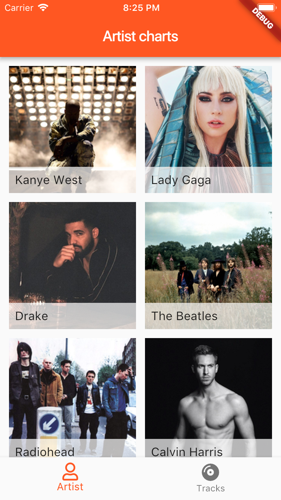
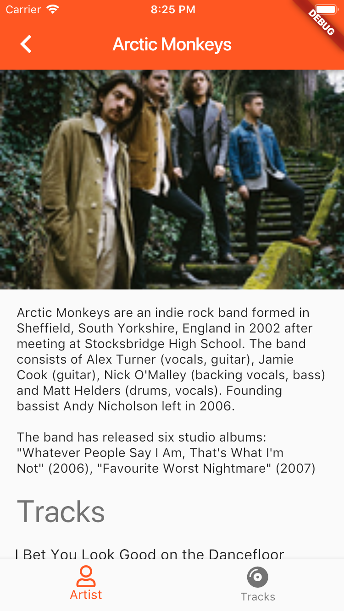
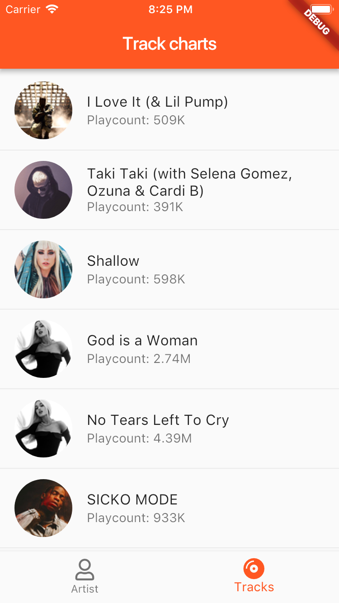

# last.fm music charts

A small example project to try flutter for mobile development. In order to make calls to the [last.fm API](https://www.last.fm/api) you need to [obtain an API key](https://www.last.fm/api/account/create). Store the key in a file `keys.json` in the root directory of this project.

I'm not planning on adding authentication or other features, as there's already an official app available.

```json
{
    "lastfm_api_key": "YOUR_API_KEY_HERE"
}
```

## Screenshots




